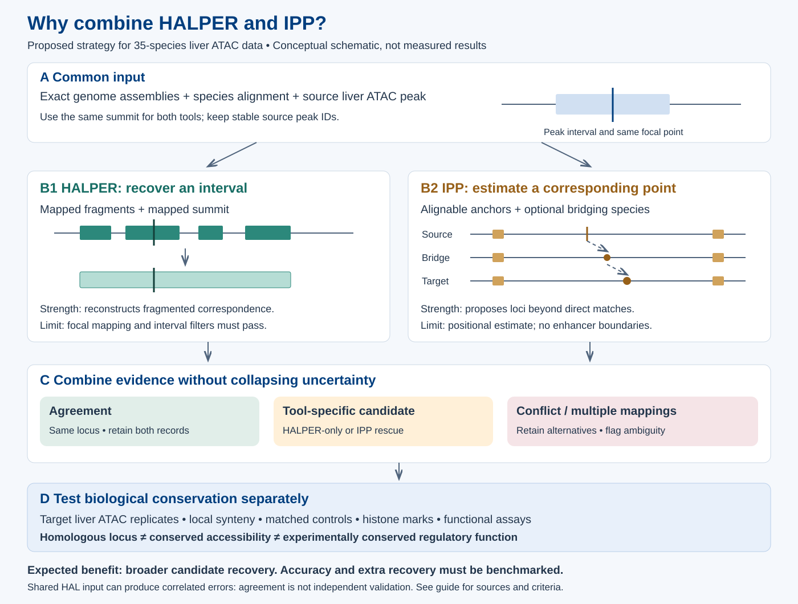

# Combining HALPER and IPP for regulatory-element discovery in 35 species

Prepared 2 October 2026. **Analysis proposal, not a completed analysis.** Commands below are templates; replace paths and genome identifiers and verify the pinned software versions before running. No website changes are part of this plan.

## 1. Objective and rationale

Identify candidate homologous loci for liver ATAC-seq regulatory elements, then test whether those loci retain liver accessibility. Use HALPER and IPP as complementary candidate generators. A larger union increases candidate recovery; it does not automatically increase accuracy.

HALPER reconstructs a contiguous target interval from fragmented `halLiftover` mappings around a mapped focal position, usually an ATAC summit. Length and summit-protection filters reject unsuitable intervals. This is useful when a regulatory interval aligns in pieces. It depends on mapping the focal position. [HALPER paper](https://pmc.ncbi.nlm.nih.gov/articles/PMC7520040/)

IPP estimates a corresponding point using alignable anchors and positional interpolation, with intermediate species offering additional projection paths. It can therefore propose a locus when direct sequence correspondence is insufficient. Its output is a position estimate, not reconstructed enhancer boundaries. The reported application supports investigating divergent regulatory loci; performance gains for our mammalian liver collection must be measured. [IPP paper](https://www.nature.com/articles/s41588-025-02202-5)



**Figure rationale.** Panel A represents a source ATAC peak with a summit. Panel B separates two useful forms of evidence: reconstructed interval correspondence and anchor-supported point correspondence. Panel C retains agreement, tool-specific candidates, and disagreement separately. Panel D applies biological evidence after mapping. The schematic illustrates a hypothesis about complementary recovery, not measured superiority or a guarantee that every rescued locus is orthologous.

If both branches use the same HAL alignment, their errors can be correlated. Agreement is algorithmic consistency, not two independent experiments. Also, Cactus already uses multiple species: IPP adds a different projection strategy, not the first use of phylogenetic information.

## 2. Inputs and software

Create `species_manifest.tsv` with one row per assembly:

```text
species_id  scientific_name  assembly_accession  fasta  chrom_sizes  hal_name  atac_peaks  summit_bed  liver_samples
```

Use exact assembly accessions and file checksums. In this project, particularly check human hg38, mouse mm10, naked mole-rat mHetGlaV3, and the actual rat and macaque assemblies. A species name alone is insufficient. Public mm39 alignments cannot be applied directly to mm10 peaks.

Additional inputs:

- Softmasked primary genome FASTAs and a species guide tree.
- Replicate-supported liver ATAC peak catalogs and genuine peak summits, with stable unique IDs.
- BAM/fragment files or consistently processed signal tracks for later quantification.
- Gene annotations, assembly gaps, repeat annotations, and mappability information where available.
- Sample metadata: tissue, age, sex, batch, assay, sequencing depth, and biological replicate.

Suggested software environments:

| Component | Purpose |
|---|---|
| Progressive Cactus and HAL tools | Genome alignment and coordinate projection |
| HALPER, Python, NumPy, Matplotlib | Interval reconstruction |
| IPP, uv, compatible C++ build tools | Point projection |
| LAST, UCSC chain tools, Snakemake | IPP's native alignment route |
| BEDTools or Python interval tools | Overlap, coordinate QC, tables |

Pin repository commits, dependency environments, and container digests. Run included examples before project data. Use a Linux computing cluster for whole-genome alignment; establish storage, memory, and runtime from a pilot rather than assuming laptop feasibility.

## 3. Build or obtain the HAL alignment

Use Progressive Cactus with matching FASTAs and a rooted, resolved guide tree. Its sequence file contains a Newick tree followed by genome-name/FASTA-path lines. Branch lengths should represent evolutionary sequence distance; do not insert divergence times in millions of years as substitution lengths. Follow the release documentation for masking, scheduling, and validation. [Cactus documentation](https://github.com/ComparativeGenomicsToolkit/cactus/blob/master/doc/progressive.md)

```bash
# Templates: run in a configured Cactus environment.
cactus jobstore/cactus species.seqfile mammals35.hal --batchSystem slurm
halStats --genomes mammals35.hal
```

Before mapping peaks, verify chromosome names and lengths against every ATAC assembly. Inspect known genes, inversions, duplicated regions, and representative distal elements. Track alignment coverage by species and chromosome. An assembly gap or low-quality alignment must remain distinguishable from evolutionary loss.

## 4. Prepare a common query catalog

Proposed project procedure:

1. Build reproducible within-species peak catalogs using biological replicates; keep original sample IDs.
2. Give each source peak a globally unique ID such as `NMR_peak_000001`.
3. Save a BED4 interval file and a BED4 one-base summit file with identical IDs.
4. Check `start <= summit < end`, valid chromosome lengths, unique IDs, and BED zero-based, half-open coordinates.
5. For narrowPeak, summit position is column 2 plus column 10. Reject missing/negative summit offsets or choose a documented alternative focal point. Do not silently call a midpoint a measured summit.

Feed **the same one-base focal positions** to IPP that are used by HALPER. This proposed comparison avoids conflating peak-center versus peak-summit differences with algorithm differences. Keep a center-based sensitivity run if needed.

Start with one high-quality source catalog, then add representative clade catalogs and previously uncovered elements. A human-only catalog cannot discover elements absent from human. Broad histone regions require a separately justified focal-point strategy; they should not inherit ATAC summit assumptions.

## 5. HALPER branch

Example for one source/target pair; `SOURCE` and `TARGET` must be HAL genome names:

```bash
mkdir -p results/halper
halLiftover mammals35.hal SOURCE inputs/SOURCE.peaks.bed \
  TARGET results/halper/SOURCE.TARGET.fragments.bed
halLiftover mammals35.hal SOURCE inputs/SOURCE.summits.bed \
  TARGET results/halper/SOURCE.TARGET.summits.bed

python /path/to/halLiftover-postprocessing/orthologFind.py \
  -qFile inputs/SOURCE.peaks.bed \
  -tFile results/halper/SOURCE.TARGET.fragments.bed \
  -sFile results/halper/SOURCE.TARGET.summits.bed \
  -min_len 50 -max_frac 2 -protect_dist 5 -narrowPeak \
  -oFile results/halper/SOURCE.TARGET.candidates.narrowPeak
```

These are **pilot settings**, not optimized cutoffs. Compare recovery and error proxies across parameter choices. Do not enable `-mult_keepone` by default: it selects the first mapping for a multiply mapped summit. Preserve raw mappings and failed records for ambiguity review. Generated narrowPeak signal fields are not measured target ATAC abundance. [HALPER command documentation](https://github.com/pfenninglab/halLiftover-postprocessing)

Classify failures by stage: unmapped summit, multiple summit mappings, excessive interval expansion, insufficient length, or failed summit protection. A failed interval is not evidence that the biological element is absent.

## 6. IPP branch: choose an alignment route

### Route A — native IPP pairwise alignments

This is the closest route to the distributed workflow. Build the environment, then follow the supplied alignment pipeline using the exact project genomes. It uses LAST and UCSC chain processing; plan cluster resources separately from point projection.

```bash
git clone https://github.com/tobiaszehnder/IPP.git
cd IPP
make sync-build

# species_ipp.txt contains the genome IDs for source, target, and bridges.
# Stage exact custom FASTAs according to the pipeline's directory convention.
compute_alignments/compute_pairwise_alignments.sh \
  -s species_ipp.txt -r SOURCE -q TARGET -c -d alignment_data -@ 16
```

Use the resulting collection's actual path in the projection command below. [IPP installation and pipeline documentation](https://github.com/tobiaszehnder/IPP)

### Route B — reuse HAL-derived chains, after a compatibility pilot

This could avoid repeating de novo genome alignment, but is **an integration proposal, not a validated drop-in replacement** for the paper's alignment pipeline.

```bash
# Cactus environment; by default exports pairs among leaf genomes.
cactus-hal2chains jobstore/chains mammals35.hal hal_chains
```

The exporter is documented in the [Cactus chain-export instructions](https://github.com/ComparativeGenomicsToolkit/cactus/blob/master/doc/progressive.md#chains-export). Before importing, check direction, chromosome lengths, strand handling, duplicate alignments, and filtering. Do not assume an export filename establishes the correct source/target orientation.

The current IPP collector expects plain-text chains named `SOURCE.TARGET.all.pre.chain`, an assembly directory containing `SPECIES.sizes`, and all ordered pairs in its comma-separated species list. It also requires each aligned block to be shorter than 32,768 bp. Inspect exported chains before import. Larger blocks require a validated adapter, for example splitting contiguous blocks while preserving coordinates and gaps; simple renaming is insufficient. Empty pair files also require testing. [Collector source](https://github.com/tobiaszehnder/IPP/blob/main/compute_alignments/collect_pwalns.py)

```bash
# Only after compatibility checks and adaptation; from the IPP repository.
uv run python compute_alignments/collect_pwalns.py \
  prepared_chains prepared_sizes SOURCE,TARGET,BRIDGE pilot.pwaln.bin
```

For a small pilot, compare HAL-derived and native IPP alignments at identical query points. Record coordinate agreement, candidate recovery, and false-match proxies. Select the production route only after this comparison.

### Project the common focal positions

```bash
# From the IPP repository, using an absolute path to the common summit BED.
uv run python src/ipp/project.py \
  -o results/ipp -n 16 -a \
  /path/to/inputs/SOURCE.summits.bed SOURCE TARGET /path/to/pilot.pwaln.bin
```

Preserve projection scores, direct and bridged positions, bridge species, anchors, and unmapped records. Keep IPP's DC/IC/NC labels as software classifications, not experimental proof of conservation. Evaluate target ATAC overlaps separately so mapping evidence and activity evidence remain independently inspectable. [IPP output documentation](https://github.com/tobiaszehnder/IPP)

## 7. Scale to 35 species

There are **595 unordered pairs and 1,190 ordered directions** among 35 species. Mapping one source catalog to 34 targets is only 34 output comparisons, but the current IPP collector still expects its complete ordered alignment collection. Exporting chains from an existing HAL is different from computing 1,190 independent whole-genome alignments. [IPP alignment workflow](https://github.com/tobiaszehnder/IPP/blob/main/compute_alignments/Snakefile)

Proposed staging:

1. Pilot 5–8 species spanning relevant distances and assembly qualities.
2. Establish both mapping branches on a manageable peak subset.
3. Benchmark runtime, memory, temporary storage, coverage, and concordance.
4. Run a primary reference catalog across 35 species.
5. Add clade-specific source catalogs to recover reference-missing elements.
6. Cache alignment collections and rerun only peak projection when catalogs change.

A smaller bridge subset is an empirical tradeoff, not a guaranteed equivalent result. Arbitrarily omitting pair files from the existing collector is not a supported shortcut.

## 8. Combine outputs without losing uncertainty

Join by source assembly, source peak ID, and target assembly. Never join genomic coordinates from different assemblies directly.

| Result | Proposed treatment |
|---|---|
| HALPER and IPP support the same locus | Agreement candidate; retain both evidence records |
| HALPER only | Interval-supported candidate; inspect IPP failure |
| IPP only, acceptable mapping evidence | Rescue candidate; prioritize validation |
| Both map to incompatible locations | Conflict; retain alternatives, exclude from strict one-to-one matrix |
| Multiple plausible target copies | Ambiguous/duplicated; do not choose the first arbitrarily |
| Neither yields a usable mapping | Unresolved; do not encode biological absence |

Proposed agreement test: require the same chromosome, compatible local orientation, and the IPP point inside the HALPER interval; also report its distance to the mapped summit. Very large intervals can create accidental agreement, so calibrate an additional summit-distance tolerance using the pilot. Do not select the tolerance to maximize the union.

For IPP-only candidates, keep the projected point as the primary result. For signal measurement, a prespecified 500-bp window around it is a useful pilot choice, with 250-bp and 1-kb sensitivity analyses. These windows are analytical units, not inferred enhancer boundaries. Apply the same measurement-window rule to HALPER candidates for fair quantitative comparisons.

Build orthogroups using supported correspondence edges and explicit one-to-many flags. Do not merge every transitively overlapping interval: that can collapse neighboring elements. Store source provenance when multiple catalogs identify the same target locus.

## 9. Validate mapping and conserved liver activity separately

Proposed validation design:

- Inspect positive controls across promoters and distal elements, not promoters alone.
- Check local gene order, inversion orientation, reciprocal mapping, and assembly gaps. Reciprocal failure is a flag rather than automatic proof of error.
- Measure agreement on held-out loci, stratified by evolutionary distance, repeats, assembly quality, and source peak strength.
- Use native pairwise alignments on a subset to assess dependence on the shared HAL alignment.
- Compare target liver ATAC overlap against matched random source loci projected through the same workflow. Match chromosome, length, GC, and relevant genomic context; do not match on the target activity outcome being tested.
- Evaluate replicate-supported signal and relevant histone marks. Keep tissue mismatches explicit.

Report three separate conclusions:

1. **Candidate homologous locus:** supported positional correspondence.
2. **Conserved liver accessibility:** correspondence plus reproducible ATAC evidence in both species.
3. **Conserved regulatory function:** stronger evidence, such as suitable perturbation or reporter experiments and target-gene support.

Accessibility alone does not establish identical enhancer function or the same target gene. Missing peaks can reflect depth, cell composition, or peak-calling differences. An unmapped locus and a well-measured inactive locus must have different codes.

## 10. Deliverables and downstream analysis

```text
regulatory_orthology/
  manifests/          # assembly checksums, sample metadata, versions, parameters
  alignments/         # HAL / chain / IPP collection manifests
  raw_halper/         # mappings, reconstructed intervals, failures
  raw_ipp/            # points, scores, anchors, bridges, unmapped IDs
  candidates.tsv      # joined evidence, conflicts, ambiguity flags
  orthogroups.tsv     # source and target membership with mapping provenance
  beds_by_species/    # browser-ready coordinates in each exact assembly
  activity_matrix.tsv
  mapping_status_matrix.tsv
  qc/                 # recovery, concordance, controls, resources, manual review
```

Suggested candidate fields: source species/build/peak ID/interval/summit; target species/build; HALPER interval and mapped summit; IPP direct/bridged coordinates and scores; anchor/bridge provenance; agreement class; ambiguity; target ATAC evidence; histone evidence; assembly-gap/repeat flags; reciprocal result; analysis version.

For lifespan analyses, quantify reproducible windows with an explicit normalization strategy and retain sample-level uncertainty. Browser CPM values alone do not establish cross-species quantitative comparability. Keep mapping confidence separate from activity. Use a strict supported set for primary PGLS/PIC analysis and the expanded rescue set for sensitivity analysis; account for missingness, batch effects, phylogeny, and multiple testing.

## 11. Recommended first implementation

Start with a small representative species panel and a fixed, diverse liver ATAC subset. Run both tools on every pilot query, not only HALPER failures, so concordance and conflicts can be measured. Then decide whether HAL-derived IPP input is adequate and which rescue thresholds are defensible. Only scale after inspecting the additional candidates.

**Success criterion:** additional credible homologous loci with reproducible biological support and documented uncertainty—not simply the largest number of reported matches.
